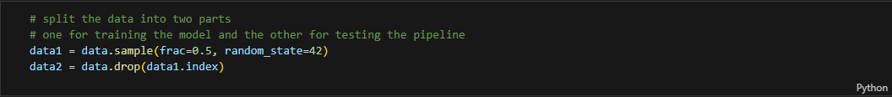
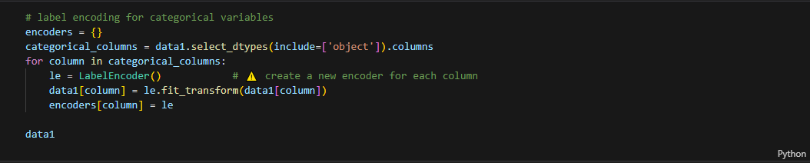
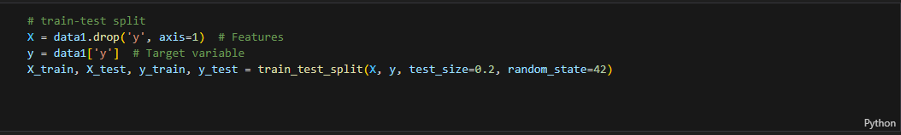
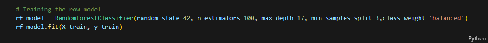
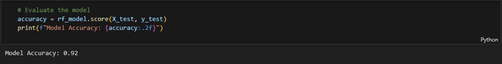

# Customer Segmentation Model

## Overview
This project implements an end-to-end machine learning pipeline that integrates directly with a database. The pipeline retrieves raw data, processes and encodes features, applies a trained model, and saves the predictions back into a separate table within the same database. The goal of this project is to operationalize machine learning so predictions can be generated automatically and consistently, supporting real-world decision-making.

---
## Features
Data Ingestion: Connects to a database and retrieves raw input data.

Preprocessing: Handles missing values, encodes categorical variables, and applies necessary transformations.

Model Training & Loading: Supports training a machine learning model or loading a previously saved one.

Prediction: Generates predictions on unseen data with flexible threshold adjustment.

Class Imbalance Handling: Includes oversampling techniques to improve recall on minority classes.

Evaluation: Produces metrics such as accuracy, precision, recall, F1-score, and confusion matrix for performance monitoring.

Deployment Integration: Saves predictions back into the database in a dedicated table for downstream use.

---
## Dataset
The model is built and tested on Bank Marketing.

Link to dataset: [Bank Marketing](https://archive.ics.uci.edu/ml/datasets/bank+marketing)

---

# 1. Building the model
## 1.1 Import libraries and load the dataset

---
## 1.2 Preprocess the data

---
## 1.3 Label encoding for categorical variables

---
## 1.4 Train-Test Split

---
## 1.5 Training the row model

---
## 1.6 Evaluate the model

---
In our project, class 1 was our main focus because it represents the customers who actually subscribed to the term deposit, which is the desired business outcome. Correctly identifying these customers is far more valuable than predicting the majority class 0, since missing a potential subscriber (false negative) means losing a real opportunity. On the other hand, predicting some extra false positives is less costly, as the marketing team can still reach out to those customers. For this reason, improving recall for class 1 was prioritized, even if it meant sacrificing a bit of overall accuracy.
---
## 1.7 Handle class imbalance with SMOTE

## Reference

Unlocking Customer Segmentation Insights — Combining RFM Analysis with K-Means Clustering
[Customer Segmentation Insights](https://ishla.medium.com/unlocking-customer-segmentation-insights-combining-rfm-analysis-with-k-means-clustering-45bdc6bf8555)  

