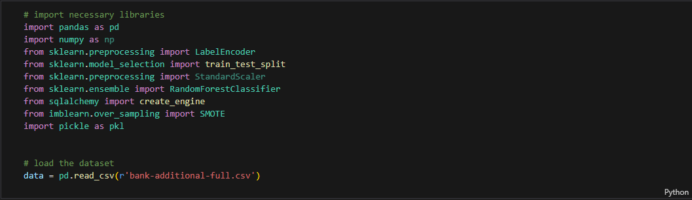

# Customer Segmentation Model

## Overview
This project implements an end-to-end machine learning pipeline that integrates directly with a database. The pipeline retrieves raw data, processes and encodes features, applies a trained model, and saves the predictions back into a separate table within the same database. The goal of this project is to operationalize machine learning so predictions can be generated automatically and consistently, supporting real-world decision-making.

---
## Features
Data Ingestion: Connects to a database and retrieves raw input data.

Preprocessing: Handles missing values, encodes categorical variables, and applies necessary transformations.

Model Training & Loading: Supports training a machine learning model or loading a previously saved one.

Prediction: Generates predictions on unseen data with flexible threshold adjustment.

Class Imbalance Handling: Includes oversampling techniques to improve recall on minority classes.

Evaluation: Produces metrics such as accuracy, precision, recall, F1-score, and confusion matrix for performance monitoring.

Deployment Integration: Saves predictions back into the database in a dedicated table for downstream use.

---
## Dataset
The model is built and tested on Bank Marketing.

Link to dataset: [Bank Marketing](https://archive.ics.uci.edu/ml/datasets/bank+marketing)

---

# 1. Building the model
## 1.1 Import libraries and load the dataset

---
## Preprocess the data

---

---
## Summary

## 1. Platinum Customers 🏆

Behavior: Extremely loyal, frequent purchases, and the highest total spend.

Loyalty: Very high — short recency, high frequency, high monetary value.

Engagement Strategy:

Exclusive early access to new products.

VIP loyalty programs.

Personalized recommendations and premium support.

## 2. Gold Customers 🥇

Behavior: Regular buyers with good spending habits, but slightly less frequent or lower spend than Platinum.

Loyalty: High — moderate recency, good frequency, high monetary value.

Engagement Strategy:

Targeted upselling and cross-selling campaigns.

Seasonal discounts or bundle offers to encourage more frequent purchases.

Invitations to special promotions to encourage transition to Platinum tier.

## 3. Silver Customers 🥈

Behavior: Occasional buyers, moderate spend, may need reactivation campaigns.

Loyalty: Medium — longer recency, lower frequency, moderate monetary value.

Engagement Strategy:

Email reminders and personalized discount codes.

Incentives like free shipping to encourage more purchases.

Customer surveys to understand potential barriers to buying

---
## Reference

Unlocking Customer Segmentation Insights — Combining RFM Analysis with K-Means Clustering
[Customer Segmentation Insights](https://ishla.medium.com/unlocking-customer-segmentation-insights-combining-rfm-analysis-with-k-means-clustering-45bdc6bf8555)  

