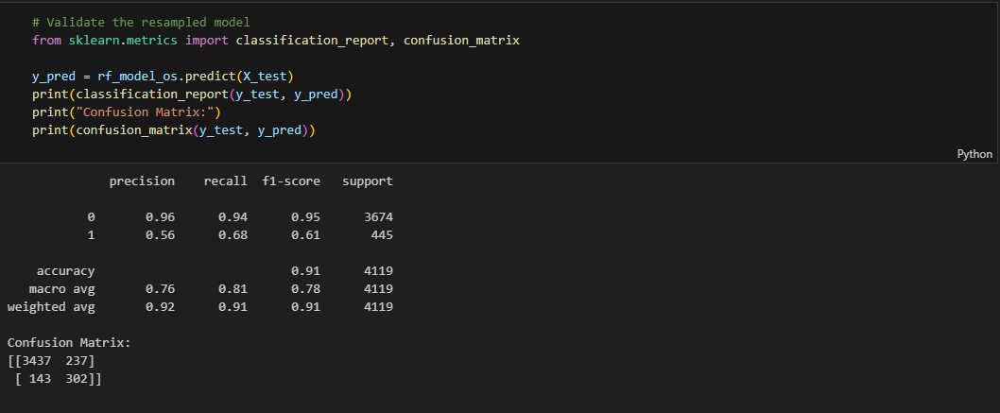

# End-to-End ML Pipline

## Overview
This project implements an end-to-end machine learning pipeline that integrates directly with a database. The pipeline retrieves raw data, processes and encodes features, applies a trained model, and saves the predictions back into a separate table within the same database. The goal of this project is to operationalize machine learning so predictions can be generated automatically and consistently, supporting real-world decision-making.

---
## Features
Data Ingestion: Connects to a database and retrieves raw input data.

Preprocessing: Handles missing values, encodes categorical variables, and applies necessary transformations.

Model Training & Loading: Supports training a machine learning model or loading a previously saved one.

Prediction: Generates predictions on unseen data with flexible threshold adjustment.

Class Imbalance Handling: Includes oversampling techniques to improve recall on minority classes.

Evaluation: Produces metrics such as accuracy, precision, recall, F1-score, and confusion matrix for performance monitoring.

Deployment Integration: Saves predictions back into the database in a dedicated table for downstream use.

---
## Dataset
The model is built and tested on Bank Marketing.

Link to dataset: [Bank Marketing](https://archive.ics.uci.edu/ml/datasets/bank+marketing)

---

# 1. Building the model
## 1.1 Import libraries and load the dataset

---
## 1.2 Preprocess the data

---
## 1.3 Label encoding for categorical variables

---
## 1.4 Train-Test Split

---
## 1.5 Training the row model

---
## 1.6 Evaluate the model

---
#### In our project, class 1 was our main focus because it represents the customers who actually subscribed to the term deposit, which is the desired business outcome. Correctly identifying these customers is far more valuable than predicting the majority class 0, since missing a potential subscriber (false negative) means losing a real opportunity. On the other hand, predicting some extra false positives is less costly, as the marketing team can still reach out to those customers. For this reason, improving recall for class 1 was prioritized, even if it meant sacrificing a bit of overall accuracy.

#### We started by training a baseline Random Forest classifier on the original imbalanced dataset. While the model achieved good overall accuracy, it struggled to correctly identify the minority class (1), which was our main interest.

#### To address this, we applied SMOTE oversampling to balance the dataset. This improved recall for class 1 since the model could now learn more patterns from the minority class. However, while recall improved, the model was still not performing at the level we wanted.

#### In our final approach, we combined oversampling with probability threshold tuning. By lowering the threshold from 0.5 to 0.3 on the oversampled model, we achieved the best balance: recall for class 1 increased significantly, while maintaining acceptable precision. We prioritized recall for class 1 because missing positive cases (false negatives) would be much more costly than allowing some additional false positives.
---
## 1.7 Handle class imbalance with SMOTE

---
## 1.8 Train the model on the resampled data

---
## 1.9 Validate the resampled model

---
## 1.10 Training the resampled model with Probabilities instead of labels

---
## 1.11 Choosing the best threshold using Precision-Recall curve

---
## 1.12 Lower threshold to 0.3 (instead of 0.5)

---
## 1.13 Validate the resampled model threshold (0.3)

---
## 1.14 Save the trained model

---
## 1.15 Drop the target variable from data2 (pipline data)

---
## 1.16 Save the pipline data to PostgreSQL

---

# 2. Building the pipline
## 2.1 Making the DAG file

---
#### Note: Even though the threshold isn't saved with the model, it's hardcoded in my pipeline code. 
---
## 2.2 Making the Docker Compose file

---
## 2.3 Making the Dockerfile

---
## 2.4 Making the Requirements.txt

---

# 3. Airflow UI

